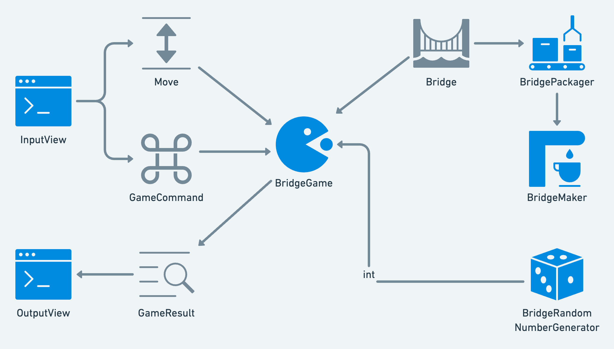

# 기능 목록

위아래 둘 중 하나의 칸만 건널 수 있는 다리를 끝까지 건너가는 게임이다.

- 다리는 왼쪽에서 오른쪽으로 건너야 한다.
- 위아래 둘 중 하나의 칸만 건널 수 있다.

## 구성 예시



- InputView
- OutputView
- BridgeGame
- BridgeBroker
- BridgeMaker
- BridgeRandomNumberGenerator

- Move
- GameCommand
- GameResult
- Bridge

## 🚀 기능 요구 사항

### BridgeGame

- [ ] 다리의 길이를 숫자로 입력받고 생성한다. - makeBridge
    - BridgeBroker 연계
- [ ] 사용자가 칸을 이동한다. - move
    - [ ] 플레이어가 선택한 칸으로 이동할 수 있는지 확인한다. - isRightWay
        - 이동할 때 위 칸은 대문자 U, 아래 칸은 대문자 D를 입력한다. - inputView 연계
        - 이동하는 칸에 대한 정보
            - 이동한 칸을 건널 수 있다면 O로 표시한다.
            - 건널 수 없다면 X로 표시한다.
- [ ] 다리를 건너다 실패하면 게임을 재시작하거나 종료할 수 있다. - retry
    - 플레이어에게 진행여부를 입력받는다. - inputView 연계
    - 재시작해도 처음에 만든 다리로 재사용한다.
- [ ] 게임의 결과를 반환한다. - getResult
- [ ] 게임 결과를 갱신한다. - updateResult
- 다리를 끝까지 건너면 게임이 종료된다.

### BridgeBroker

- [ ] 값으로 이루어진 다리를 Bridge 클래스로 변환하여 반환한다. - makeBridge
    - [ ] 다리 생성을 요청한다. - requestBridge
        - BridgeMaker 연계
    - [ ] 값으로 이루어진 다리를 Bridge 클래스로 변환한다. - packageBridge

### BridgeMaker

- [ ] 다리의 길이를 숫자로 입력받고 생성한다. - makeBridge
    - 다리를 생성할 때 위 칸과 아래 칸 중 건널 수 있는 칸은 0과 1 중 무작위 값을 이용해서 정한다. - BridgeRandomNumberGenerator 연계
    - 위 칸을 건널 수 있는 경우 U, 아래 칸을 건널 수 있는 경우 D값으로 나타낸다.
    - 무작위 값이 0인 경우 아래 칸, 1인 경우 위 칸이 건널 수 있는 칸이 된다.

### InputView

- [ ] 자동으로 생성할 다리 길이를 입력 받는다. - readBridgeSize
    - 3 이상 20 이하의 숫자를 입력할 수 있으며
    - 올바른 값이 아니면 예외 처리한다.
        - [ ] 입력값이 숫자인지 확인 - validateBridgeSizeType
        - [ ] 입력값이 범위내인지 확인 - validateBridgeSizeRange
    - [ ] 입력된 문자열을 숫자로 변환한다. - convertToInteger
- [ ] 라운드마다 플레이어가 이동할 칸을 입력 받는다. - readMoving
    - U(위 칸)와 D(아래 칸) 중 하나의 문자를 입력할 수 있으며
    - 올바른 값이 아니면 예외 처리한다.
        - Move 클래스 생성시 연계
- [ ] 게임 재시작/종료 여부를 입력 받는다. - readGameCommand
    - R(재시작)과 Q(종료) 중 하나의 문자를 입력할 수 있으며
    - 올바른 값이 아니면 예외 처리한다.
        - GameCommand 클래스 생성시 연계
- 사용자가 잘못된 값을 입력할 경우 `IllegalArgumentException`를 발생시키고, "[ERROR]"로 시작하는 에러 메시지를 출력 후 그 부분부터 입력을 다시 받는다.
    - `Exception`이 아닌 `IllegalArgumentException`, `IllegalStateException` 등과 같은 명확한 유형을 처리한다.

### OutputView

- [ ] 게임 처음 시작시 환영메세지 출력 - printWelcome

- [ ] 사용자가 이동할 때마다 다리 건너기 결과를 출력한다 - printGame
    - [ ] 다리를 출력한다. - printMap
        - 이동할 수 있는 칸을 선택한 경우 O 표시
        - 이동할 수 없는 칸을 선택한 경우 X 표시
        - 선택하지 않은 칸은 공백 한 칸으로 표시
        - 다리의 시작은 `[`, 다리의 끝은 `]`으로 표시
        - 다리 칸의 구분은 ` | `(앞뒤 공백 포함) 문자열로 구분
        - 현재까지 건넌 다리를 모두 출력
    - [ ] 게임 진행 상황을 출력한다. - printResult
        - '게임 성공 여부: 성공'
        - '총 시도한 횟수: 2'

```
최종 게임 결과
[ O |   |   ]
[   | O | O ]

게임 성공 여부: 성공
총 시도한 횟수: 2
```

- [ ] 예외 상황 시 에러 문구를 출력해야 한다. 단, 에러 문구는 "[ERROR]"로 시작해야 한다. - printException

```
[ERROR] 다리 길이는 3부터 20 사이의 숫자여야 합니다.
```

- 사용자가 이동할 때마다 다리 건너기 결과의 출력 형식은 실행 결과 예시를 참고한다.

### Move
- [x] 움직임을 나타내는 용어들을 저장한다.
- [ ] 입력 값 검증 - validate
    - U(위 칸)와 D(아래 칸) 중 하나의 문자를 입력할 수 있으며 올바른 값이 아니면 예외 처리한다. - validateWord
    - 위 칸과 아래 칸 중 건널 수 있는 칸은 0과 1 중 무작위 값을 이용해서 정한다.

### GameCommand
- [ ] 게임 진행여부와 관련된 용어들을 저장한다.
- [ ] 입력 값 검증 - validate
    - R(재시작)과 Q(종료) 중 하나의 문자를 입력할 수 있으며 올바른 값이 아니면 예외 처리한다. - validateWord

### GameResult
- [ ] 게임 결과와 관련된 정보를 저장한다.
- [ ] 게임 결과의 총 시도한 횟수는 첫 시도를 포함해 게임을 종료할 때까지 시도한 횟수를 나타낸다.

### Bridge
- [ ] 다리의 정보를 저장한다.
